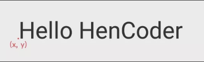

# Android 属性动画
## 做 translation 平移动画是以自身为原点
 
```java

public void setAnimator(View correct, View next) {
        setDefault(next);
        mAnimatorSet.playTogether(
                ObjectAnimator.ofFloat(correct, "translationX",
                        0,
                        ChangeUnits.change(correct.getContext(), -correct.getWidth()))
                , ObjectAnimator.ofFloat(correct, "rotationY", 180, 90)
        );
    }
```
## PropertyValuesHolder 同一个动画中改变多个属性
```java
PropertyValuesHolder holder1 = PropertyValuesHolder.ofFloat("scaleX", 1);
PropertyValuesHolder holder2 = PropertyValuesHolder.ofFloat("scaleY", 1);
PropertyValuesHolder holder3 = PropertyValuesHolder.ofFloat("alpha", 1);

ObjectAnimator animator = ObjectAnimator.ofPropertyValuesHolder(view, holder1, holder2, holder3)
animator.start();
```
# canva绘制Text
* drawText(String text, float x, float y, Paint paint)
> 1. text 是文字内容，x 和 y 是文字的坐标。但需要注意：这个坐标并不是文字的左上角，而是一个与左下角比较接近的位置.

- drawTextOnPath(String text, Path path, float hOffset, float vOffset, Paint paint)
> 1. drawTextOnPath() 使用的 Path ，拐弯处全用圆角，别用尖角。
> 2. hOffset 和 vOffset。它们是文字相对于 Path 的水平偏移量和竖直偏移量，利用它们可以调整文字的位置。例如你设置 hOffset 为 5， vOffset 为 10，文字就会右移 5 像素和下移 10 像素。
* 使绘制的文本支持换行 ***StaticLayout***
> StaticLayout 并不是一个 View 或者 ViewGroup ，而是 android.text.Layout 的子类，它是纯粹用来绘制文字的。StaticLayout 支持换行，它既可以为文字设置宽度上限来让文字自动换行，也会在 \n 处主动换行。
```java
String text1 = "Lorem Ipsum is simply dummy text of the printing and typesetting industry.";
StaticLayout staticLayout1 = new StaticLayout(text1, paint, 600,
        Layout.Alignment.ALIGN_NORMAL, 1, 0, true);
String text2 = "a\nbc\ndefghi\njklm\nnopqrst\nuvwx\nyz";
StaticLayout staticLayout2 = new StaticLayout(text2, paint, 600,
        Layout.Alignment.ALIGN_NORMAL, 1, 0, true);

...

canvas.save();
canvas.translate(50, 100);
staticLayout1.draw(canvas);
canvas.translate(0, 200);
staticLayout2.draw(canvas);
canvas.restore();
```
* StaticLayout(CharSequence source, TextPaint paint, int width, Layout.Alignment align, float spacingmult, float spacingadd, boolean includepad)
> 1. width 是文字区域的宽度，文字到达这个宽度后就会自动换行；
> 2. align 是文字的对齐方向；spacingmult 是行间距的倍数，通常情况下填 1 就好；
> 3. spacingadd 是行间距的额外增加值，通常情况下填 0 就好；
> 4. includeadd 是指是否在文字上下添加额外的空间，来避免某些过高的字符的绘制出现越界。
# canvas几何变换
## 使用 Canvas 来做常见的二维变换；
1. Canvas.translate(float dx, float dy) 平移
> 参数里的 dx 和 dy 表示横向和纵向的位移。
```java
canvas.save();
canvas.translate(200, 0);
canvas.drawBitmap(bitmap, x, y, paint);
canvas.restore();
```
2. Canvas.rotate(float degrees, float px, float py) 旋转
> 参数里的 degrees 是旋转角度，单位是度（也就是一周有 360° 的那个单位），方向是顺时针为正向； px 和 py 是轴心的位置。
```java
canvas.save();
canvas.rotate(45, centerX, centerY);
canvas.drawBitmap(bitmap, x, y, paint);
canvas.restore();
```
3. Canvas.scale(float sx, float sy, float px, float py) 放缩
> 参数里的 sx sy 是横向和纵向的放缩倍数； px py 是放缩的轴心。
```java
canvas.save();
canvas.scale(1.3f, 1.3f, x + bitmapWidth / 2, y + bitmapHeight / 2);
canvas.drawBitmap(bitmap, x, y, paint);
canvas.restore();
```
4. Canvas.skew(float sx, float sy) 错切
> 参数里的 sx 和 sy 是 x 方向和 y 方向的错切系数。
```java
canvas.save();
canvas.skew(0, 0.5f);
canvas.drawBitmap(bitmap, x, y, paint);
canvas.restore();
```
## 使用 Matrix 来做常见和不常见的二维变换；
1. 创建 Matrix 对象；
2. 调用 Matrix 的 pre/postTranslate/Rotate/Scale/Skew() 方法来设置几何变换；
3. 使用 Canvas.setMatrix(matrix) 或 Canvas.concat(matrix) 来把几何变换应用到 Canvas。
> * Canvas.setMatrix(matrix)：用 Matrix 直接替换 Canvas 当前的变换矩阵，即抛弃 Canvas 当前的变换，改用 Matrix 的变换；
> * Canvas.concat(matrix)：用 Canvas 当前的变换矩阵和 Matrix 相乘，即基于 Canvas 当前的变换，叠加上 Matrix 中的变换。
```java
Matrix matrix = new Matrix();

...

matrix.reset();
matrix.postTranslate();
matrix.postRotate();

canvas.save();
canvas.concat(matrix);
canvas.drawBitmap(bitmap, x, y, paint);
canvas.restore();
```
## 使用 Camera 来做三维变换。
### Camera 的三维变换有三类：旋转、平移、移动相机。
* Camera.rotate*() 三维旋转
> * Camera.rotate*() 一共有四个方法： rotateX(deg) rotateY(deg) rotateZ(deg) rotate(x, y, z)。
> * ***注意:***
>> * Camera 和 Canvas 一样也需要保存和恢复状态才能正常绘制，不然在界面刷新之后绘制就会出现问题。
>> * Canvas 的几何变换顺序是反的，所以要把移动到中心的代码写在下面，把从中心移动回来的代码写在上面。
```java
canvas.save();

camera.save(); // 保存 Camera 的状态
camera.rotateX(30); // 旋转 Camera 的三维空间
camera.applyToCanvas(canvas); // 把旋转投影到 Canvas
camera.restore(); // 恢复 Camera 的状态

canvas.drawBitmap(bitmap, point1.x, point1.y, paint);
canvas.restore();
```
* Camera.translate(float x, float y, float z) 移动
* Camera.setLocation(x, y, z) 设置虚拟相机的位置
> 这个方法的参数的单位不是像素，而是 inch，英寸。这种设计源自 Android 底层的图像引擎 Skia 。在 Skia 中，Camera 的位置单位是英寸，英寸和像素的换算单位在 Skia 中被写死为了 72 像素，而 Android 中把这个换算单位照搬了过来。是的，它。写。死。了。
>> ***在 Camera 中，相机的默认位置是 (0, 0, -8)（英寸）。8 x 72 = 576，所以它的默认位置是 (0, 0, -576)（像素）。
如果绘制的内容过大，当它翻转起来的时候，就有可能出现图像投影过大的「糊脸」效果。而且由于换算单位被写死成了 72 像素，而不是和设备 dpi 相关的，所以在像素越大的手机上，这种「糊脸」效果会越明显。***
>> * 而使用 setLocation() 方法来把相机往后移动，就可以修复这种问题。
>>> camera.setLocation(0, 0, newZ);
